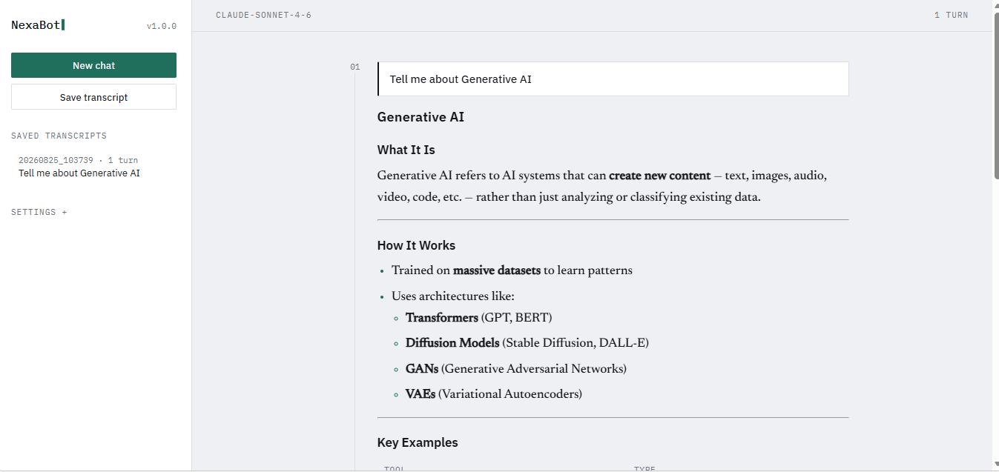

# NexaBot

A chatbot powered by the [Anthropic API](https://docs.claude.com), with two front ends over one engine: a **web UI** in the browser and a **terminal UI**. Both stream replies live, remember conversation history, and read/write the same saved transcripts.


## 📸 Project Snapshot



## Features

- 🔴 **Live streaming replies** — tokens render as they arrive, as Markdown (code blocks, lists and tables included)
- 🖥️ **Web UI** — a numbered conversation log in the browser, with model/system-prompt controls and one-click transcript saving
- 🎨 **Designed terminal UI** — framed messages, a spinner while the model thinks, and a readable line length on wide screens
- 💬 **Multi-turn memory** — the model sees the full conversation, not just the last message
- 💾 **Save / load sessions** — pick up a conversation later
- ⚙️ **Configurable** — swap models, system prompt, and max tokens via flags
- 🧪 **Tested** — unit tests with mocked API calls, plus CI on every push
- 📦 **Installable** — `pip install -e .` gives you a `chatbot` command

## Quick start

```bash
git clone https://github.com/YOUR_USERNAME/NexaBot.git
cd  NexaBot

python -m venv venv
source venv/bin/activate   # Windows: venv\Scripts\activate

pip install -r requirements.txt

cp .env.example .env
# then edit .env and add your ANTHROPIC_API_KEY
# get one at https://console.anthropic.com/settings/keys

python -m chatbot.web    # browser UI at http://127.0.0.1:5000


## The web UI

```bash
python -m chatbot.web
```

It starts on <http://127.0.0.1:5000> and opens your browser. What's there:

| | |
|---|---|
| **Conversation log** | each exchange is one numbered entry — your question, the reply, and the model and response time underneath |
| **Live streaming** | tokens appear as they arrive, then re-render as Markdown once the reply finishes |
| **New chat / Save transcript** | saves to the same `~/.ai_chatbot_cli/sessions/` folder the CLI uses |
| **Saved transcripts** | click any past conversation in the left rail to reload it and keep going |
| **Settings** | change model, max tokens, and system prompt without restarting |

It binds to `127.0.0.1` only, so it isn't reachable from other machines on your
network. It holds one conversation in memory on the server — fine for running
locally, which is what it's for. To serve several people you'd key the session
by a signed cookie; `chatbot/web.py` marks the spot.

## Usage

### Interactive chat

```bash
python -m chatbot.cli
```

In-chat commands:

| Command | Description |
|---|---|
| `/new` | start a new conversation (clears history) |
| `/save` | save the current conversation to `~/.ai_chatbot_cli/sessions/` |
| `/load <path>` | load a previously saved conversation |
| `/system <text>` | change the system prompt mid-session |
| `/help` | show available commands |
| `/exit`, `/quit` | leave the chat |

### One-off message (non-interactive, good for scripting)

```bash
python -m chatbot.cli --message "Summarize the plot of Hamlet in two sentences."
```

The panels are for humans, so they switch themselves off when nobody's watching:
if stdout isn't a terminal (piping, redirecting, CI) the output falls back to
plain text automatically. Force it with `--plain`:

```bash
python -m chatbot.cli --plain -m "Give me three tag ideas." > tags.txt
```

### Custom model / system prompt / token limit

```bash
python -m chatbot.cli \
  --model claude-opus-4-8 \
  --system "You are a sarcastic pirate." \
  --max-tokens 500
```

### As an installed command

```bash
pip install -e .
chatbot --message "Hello!"
```

## Project structure

```
NexaBot/
├── chatbot/
│   ├── __init__.py
│   ├── core.py         # ChatSession + ChatBot: API calls, streaming, save/load
│   ├── ui.py           # terminal presentation: theme, panels, live Markdown
│   ├── cli.py          # argument parsing + interactive REPL
│   ├── web.py          # Flask server: SSE streaming + transcript API
│   ├── templates/
│   │   └── index.html
│   └── static/
│       ├── style.css
│       └── app.js
├── tests/
│   └── test_core.py    # unit tests (API calls mocked, no network needed)
├── .github/workflows/tests.yml   # CI: runs pytest on 3.9 / 3.11 / 3.12
├── requirements.txt
├── requirements-dev.txt
├── setup.py
├── .env.example
└── README.md
```

## Running tests

```bash
pip install -r requirements-dev.txt
pytest -v
```

Tests mock the Anthropic client, so no API key or network access is needed to run them.

## How it works

- `ChatSession` (in `chatbot/core.py`) holds the message history, model name, system prompt, and token limit, and knows how to serialize itself to/from JSON for save/load.
- `ChatBot` wraps the `anthropic.Anthropic` client and uses `client.messages.stream(...)` so replies print token-by-token instead of waiting for the full response.
- `chatbot/cli.py` is a thin REPL on top of that: it reads input, dispatches slash-commands, and otherwise forwards text to `ChatBot.send()`.
- `chatbot/web.py` is a Flask layer over that same `ChatBot`. It holds no model logic — it streams tokens to the browser over Server-Sent Events and exposes the save/load/settings operations as JSON endpoints, so the web UI and the CLI stay genuinely interchangeable.
- `chatbot/ui.py` owns every decision about how the terminal looks. It exposes two interchangeable renderers behind one small interface — `RichUI` (panels, colour, live Markdown) and `PlainUI` (plain `print`) — so the REPL never has to know which one it's talking to, and adding a new front end means writing one class rather than editing the loop.

## Extending it

Some natural next steps if you want to build on this:
- Add `prompt_toolkit` for slash-command autocompletion and multi-line input
- Add tool use (function calling) so the bot can call external APIs
- Add RAG by loading documents into a vector store before each request
- Support multiple concurrent sessions keyed by user ID


